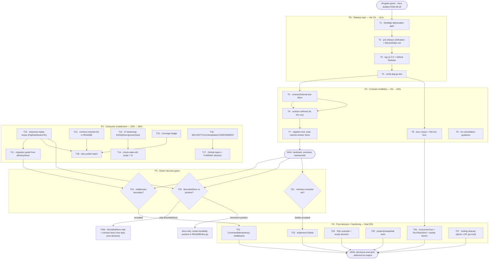

# Execution Plan: v0.2.0 Release Train & SDK Hardening

> **Status:** ✅ EXECUTED 2026-08-29 (same day). All tasks T1–T27 done except: **T22 (`Delete`) intentionally deferred** per [ADR-004](../../adr/004-store-interface-evolution.md) — the owner raised the domain concern that claim invalidation must not become request-path API; revisit on demonstrated need. **T17 FUNDING**: omitted (owner preference; no preference on record). **T15**: Codecov wired + badge added; dashboard activation (one login) left to the owner since it cannot be done from CI. **T27 dprint**: `dprint.json` kept for optional local use, deliberately not wired into CI (tool not in the CI image; Go formatting is enforced by gofmt/gofumpt/golines, living docs by the stale-refs job). **T27.2 LSP fix**: golangci_lint_ls env overrides added to the user's global Crush config (takes effect next session).
> **Created:** 2026-08-29 15:18 CEST
> **Method:** Pareto planning (`pareto-planning` skill) over 50 candidate items
> **Inputs:** `docs/status/2026-08-29_15-09_docs-health-audit-execution-status.md` section (f) (50 items), `TODO_LIST.md` (8 items), PapDashboard consumer evaluation (`docs/feedback/new/2026-08-18_13-07_*.md`), 3 owner decisions open since 2026-08-07
> **Goal:** Land the completed-but-unreleased v0.2.0 work, make the two load-bearing SDK promises (deprecation = enforced, `RunTests` = proof) mechanically true, close the consumer-facing gaps that stopped a real adoption, and route everything else to explicit decisions or an honest deferred list.

---

## Context

The docs-health audit (2026-08-29) verified every living doc against code and fixed all drift. What remains is **execution**, not documentation. Four facts shape this plan:

1. **v0.2.0 content is 100% complete and green** (contract suite, fuzz tests, memory benchmarks, godoc examples, ADR-001, interface-first reframe, deprecation — now consistent on every surface). It has been sitting untagged since 2026-08-07. Releasing is the single action that converts ~15 finished items from "on master" to "in consumers' hands".
2. **The two core SDK promises are still only prose.** "MemoryStore is deprecated" has no lint enforcement; "verify your backend with `RunTests`" ships a suite with 0% coverage of itself and no proof that it can actually catch a broken implementation.
3. **A real consumer told us exactly why they walked away** (PapDashboard): no response-replay story, no shippable in-process store, no middleware. Two of the three are doc/design-level fixes; the third is blocked on one decision.
4. **Three owner decisions block the biggest items** (middleware boundary, bounded store, interface evolution). This plan makes them explicit, cheap decision tasks instead of invisible blockers.

**Anti-Verschlimmbesserung guard (carried from the 2026-08-07 plan — still rejected, do not re-introduce):**

| Rejected | Why |
| --- | --- |
| OpenTelemetry tracing | Heavy dependency; violates zero-dep philosophy. Consumers wrap `Store` themselves. |
| `sync.Map` / sharded mutexes / lock-free prototypes | Premature — zero evidence of contention bottleneck; benchmarks exist to revisit with data. |
| Comparison tables with other libraries | Marketing fluff; rots; invites bike-shedding. |
| GoReleaser | Manual `git tag` works at this release cadence. |
| Production backends in this module | ADR-001. Forever out of scope. |
| NEW: no new runtime dependencies in `go.mod` | `go-error-family` stays the only runtime dep; everything else is dev/test-only. |
| NEW: no breaking interface changes outside a planned minor bump | `Delete`/`Stats`/`ErrStoreClosed` land as a deliberate, documented v0.x evolution — never ad hoc. |

---

## Step 1 — Pareto Breakdown

### The 1% that delivers 51%: **Cut the v0.2.0 release train**

Everything for v0.2.0 is finished and verified; the only thing between consumers and a year-class of work (contract suite, fuzz tests, deprecation, reframe) is a lint rule, a tag, and a release page. Like the 2026-08-07 plan's "Redis example makes the SDK promise real", the release makes the *finished work* real. It includes the `forbidigo` gate first (≈30 min) so the release notes can say "deprecation is **enforced**" — true, not aspirational.

**Tasks:** T1 (forbidigo gate) → T2 (pre-release verification) → T3 (tag + GitHub Release) → T4 (verify pkg.go.dev).

### The 4% that delivers 64%: 1% + **make the two load-bearing promises mechanically true**

The SDK's whole credibility rests on two sentences: *"MemoryStore is deprecated"* and *"prove your backend with `RunTests`"*. Today both are prose. The 4% adds: a self-tested contract suite (internal test-only Store + negative test proving `RunTests` catches a broken implementation) and a hardened fuzz corpus. After this, the deprecation cannot silently regress and the verification tool is provably trustworthy.

**Tasks:** T5–T9.

### The 20% that delivers 80%: 4% + **consumer-facing completeness**

PapDashboard walked for three named reasons; two are cheap to fix and the third becomes a decision. The 20% adds: the response-replay composition recipe (the single doc change that flips "this library doesn't do idempotency properly" into "here's the 20-line pattern"), the MemoryStore migration guide, context-cancellation test guidance, the contract invariant list rendered for consumers, CI hardening (gofmt/tidy/fuzz/stale-refs), coverage badge, and repo hygiene (SECURITY.md, templates, topics).

**Tasks:** T10–T18.

### The other 20% (to reach 100%)

Three owner decisions (middleware boundary, bounded store vs documented position, interface evolution) gate the big implementation items: `Delete`, the middleware package, SQL/DynamoDB example scoping, plus testing hardening and tooling cleanup. Everything that is neither decision-gated nor high-value is **explicitly deferred with a reason** (Deferred table) — not silently dropped.

**Tasks:** T19–T27 + Deferred table.

---

## Step 2 — Comprehensive Plan (30–100 min tasks, all 50 TODOs included)

Sorted by importance/impact/effort/customer-value. "Owner" tasks are decision briefs prepared by an agent, decided by the owner.

| #   | Phase | Task                                                                                                                              | Impact   | Effort | Customer value | Depends on | Covers f-items |
| --- | ----- | --------------------------------------------------------------------------------------------------------------------------------- | -------- | ------ | -------------- | ---------- | -------------- |
| T1  | P0    | Add `forbidigo` deprecation gate to `.golangci.yml` (block `NewMemoryStore`/`MemoryStore{}` outside `_test.go`), verify via CLI lint + a deliberate violation, then commit | High     | 45min  | Honest deprecation | —          | f-2            |
| T2  | P0    | v0.2.0 pre-release verification: `go doc ./...` render check, CHANGELOG `[Unreleased]` review against git log, gofmt + `go mod tidy` diff clean, full gate; write release notes + `RELEASING.md` checklist | High     | 60min  | Trustworthy release | T1         | f-1, f-36      |
| T3  | P0    | Tag `v0.2.0` (annotated), push, create GitHub Release with notes extracted from CHANGELOG                                          | Critical | 30min  | Everything ships   | T2         | f-1            |
| T4  | P0    | Verify pkg.go.dev renders v0.2.0 + deprecation notices; capture proof in release notes                                             | Medium   | 30min  | Consumer trust     | T3         | f-1, f-40(old) |
| T5  | P1    | Create `contract/internal` test-only in-process `Store` (memory map, no sweep) that the suite can validate itself against           | Medium   | 45min  | Trustworthy suite  | —          | f-6            |
| T6  | P1    | Add `contract/contract_test.go` running `RunTests` against the internal Store; fixes `contract/` 0% coverage                       | Medium   | 45min  | Trustworthy suite  | T5         | f-6            |
| T7  | P1    | Negative contract test: deliberately broken Store (non-atomic CheckAndRecord), assert `RunTests` fails — proves the suite catches bugs | High     | 45min  | Trustworthy suite  | T6         | f-6            |
| T8  | P1    | Enrich fuzz seed corpus (unicode, empty, 4KB key, `math.MaxInt64`, negative TTL) + 60s live fuzz run                                | Medium   | 30min  | Robustness proof   | —          | f-7            |
| T9  | P1    | Document context-cancellation test guidance for custom backends (contract package docs + README snippet)                           | Low      | 30min  | Backend authors    | —          | f-15           |
| T10 | P2    | Response-replay composition recipe in `doc.go`: `ResponseCache` pattern (~20 lines) wrapping `Store`, plus README link              | High     | 60min  | Unblocks HTTP consumers | T4      | f-3            |
| T11 | P2    | Write `docs/migrating-from-memorystore.md`: worked custom-backend example + `contract.RunTests` wiring + swap instructions          | Medium   | 60min  | Migration path     | T4         | f-14           |
| T12 | P2    | Render the contract invariant list (what `RunTests` checks, per subtest) in README + CONTRIBUTING                                  | Medium   | 30min  | Backend authors    | T6         | f-16           |
| T13 | P2    | CI hardening: gofmt check, `go mod tidy` diff check, 30s fuzz job, `govulncheck` job                                               | Medium   | 60min  | Regression safety  | —          | f-26, f-27, f-29 |
| T14 | P2    | `scripts/check-stale-refs.sh` (grep deprecation aliases + `store.go:\d+` refs in living docs) + wire into CI                        | Medium   | 45min  | No doc rot         | —          | f-40           |
| T15 | P2    | Coverage badge: choose Codecov, wire token + upload, add README badge                                                              | Low      | 45min  | Visible quality    | —          | f-7(old)       |
| T16 | P2    | Repo hygiene batch: SECURITY.md, CODE_OF_CONDUCT.md, issue/PR templates, CODEOWNERS, CHANGELOG entry template                      | Low      | 60min  | Contributor trust  | —          | f-32–f-35, f-37 |
| T17 | P2    | GitHub topics (`go`, `idempotency`, `cqrs`, `deduplication`, `golang`) + FUNDING.yml decision                                       | Low      | 30min  | Discoverability    | —          | f-31, f-50     |
| T18 | P2    | Docs polish batch: "Common pitfalls" section, backend feature matrix, cross-links Store methods ↔ contract invariants, `doc.go` ToC, retry/backoff guidance, `example/` dir | Low | 100min | Onboarding         | T10, T12   | f-19–f-24, f-23(old) |
| T19 | P3    | **Owner decision brief:** middleware module boundary — (a) subpackage / (b) sibling module / (c) per-transport; recommendation + dependency impact | Critical | 30min  | Unblocks #1 feature | —         | f-5            |
| T20 | P3    | **Owner decision brief:** `BoundedStore(maxEntries, ttl)` vs documented restart-durability position (PapDashboard B2)              | High     | 30min  | Wins back single-process consumers | — | f-4       |
| T21 | P3    | **Owner decision brief:** interface evolution — `Delete`, `Stats`, `Reset`, `ErrStoreClosed`, `CheckAndRecord` return shape; SemVer + docs plan per item | High | 45min | API clarity        | —          | f-9–f-13       |
| T22 | P4    | Implement `Delete(ctx, key)` per T21: interface + MemoryStore + contract tests + docs + CHANGELOG (minor-bump framing)             | High     | 100min | Manual invalidation | T21        | f-9            |
| T23 | P4    | Implement `CommandIdempotency` middleware skeleton per T19 boundary decision (stdlib-only first) + tests + docs                     | Critical | 100min | Primary integration point | T19 | f-8       |
| T24 | P4    | SQL adapter example in `doc.go`; explicit scope decision (accept or reject) for DynamoDB/MongoDB examples                           | Low      | 45min  | Backend authors    | T10        | f-17, f-18     |
| T25 | P4    | Testing hardening batch: property test for TTL validation, `errors.Is`-across-wrapping test, goroutine-leak test after `Close`       | Medium   | 60min  | Correctness proof  | —          | f-41–f-43      |
| T26 | P4    | Concurrent fuzz test, `RunTestsStrict` (CI-safe timeouts), sweep-overhead benchmark                                                 | Low      | 60min  | Robustness data    | T8, T6     | f-44, f-45, f-47 |
| T27 | P4    | Tooling cleanup: dprint decision (install + CI check, or drop `dprint.json`), LSP cache env fix, verify go.mod 1.26.7 bump committed | Low      | 45min  | Dev experience     | —          | f-28, f-39, f-38 |

**Total:** 27 tasks ≈ 22.5 h. Coverage proof: every item from status-report section (f) #1–#50 maps to a task above or a row in the Deferred table below — nothing silently dropped.

### Deferred (explicitly, with reasons)

| Deferred item                                        | Reason                                                                 |
| ---------------------------------------------------- | ---------------------------------------------------------------------- |
| Semver-breaking-change CI check (f-30)               | Only valuable once interface evolution lands (post-T21); revisit then. |
| Reference Redis backend repo, separate module (f-25) | Post-v0.2.0; needs its own repo + maintenance commitment.              |
| Key generation utilities (f-48)                      | ROADMAP raw idea; no owner demand beyond PapDashboard's replay need.   |
| Metrics hooks + `slog` logging (f-49)                | ROADMAP; observability only pays off with production deployments.      |
| Clock injection for deterministic TTL tests (f-46)   | Changes `Store`/`MemoryStore` API — bundle with T21 interface decision. |
| All Contributors / FUNDING (f-50)                    | Owner preference; zero code value.                                     |

---

## Step 3 — Fine-Grained Breakdown (sub-tasks ≤ 12 min each, all todos)

Sorted in execution order within each task; tasks in the same order as Step 2.

### T1 — forbidigo deprecation gate (45 min)

| #     | Sub-task                                                                                     | Est  | Verifies                                  |
| ----- | ---------------------------------------------------------------------------------------------- | ---- | ----------------------------------------- |
| 1.1   | Read `forbidigo` settings block in `.golangci.yml` to learn existing pattern syntax             | 5min | Current rules understood                  |
| 1.2   | Add forbidigo rule: forbid `NewMemoryStore` and `MemoryStore{` outside `*_test.go`              | 8min | Config updated                            |
| 1.3   | Write a scratch non-test file using `NewMemoryStore`; run `golangci-lint` → must FAIL            | 8min | Gate fires                                |
| 1.4   | Delete scratch file; run full lint → 0 issues                                                   | 5min | Gate precise (no false positives)         |
| 1.5   | Run `go test ./... -race` to confirm nothing else broke                                         | 7min | Gate green                                |
| 1.6   | Update TODO_LIST (tick deprecation lint gate) + CHANGELOG `[Unreleased]` → Added                | 7min | Docs current                              |
| 1.7   | Commit: `chore(lint): forbid MemoryStore usage outside tests`                                   | 5min | Detailed commit exists                    |

### T2 — v0.2.0 pre-release verification (60 min)

| #     | Sub-task                                                                                          | Est  | Verifies                              |
| ----- | --------------------------------------------------------------------------------------------------- | ---- | --------------------------------------- |
| 2.1   | `go doc ./...` full render read-through: deprecation notices, Redis example, ErrInvalidTTL           | 10min | Godoc surfaces correct                 |
| 2.2   | Diff CHANGELOG `[Unreleased]` against `git log v0.1.2..HEAD` — nothing missing, nothing wrong        | 10min | Changelog complete                     |
| 2.3   | Set `[Unreleased]` → `[0.2.0] - <date>` heading + add compare link `v0.1.2...v0.2.0`                | 5min  | Keep-a-Changelog format                 |
| 2.4   | Gates: gofmt -l, `go mod tidy` diff, `go vet`, lint, `go test -race`                                 | 12min | All green                               |
| 2.5   | Draft release notes (breaking-ish notes: TTL rejection; deprecation; contract suite)                 | 12min | Notes drafted                           |
| 2.6   | Write `RELEASING.md` checklist (gofmt, tidy, doc, test -race, tag, push, release, verify pkg.go.dev) | 8min  | Repeatable release process              |
| 2.7   | Commit: `chore(release): finalize v0.2.0 changelog and release checklist`                            | 3min  | Committed                               |

### T3 — Tag + GitHub Release (30 min)

| #     | Sub-task                                                                     | Est  | Verifies                    |
| ----- | ------------------------------------------------------------------------------ | ---- | ----------------------------- |
| 3.1   | Create annotated tag `v0.2.0` with release-notes summary as message             | 5min | Tag exists locally            |
| 3.2   | Push tag; confirm module proxy accepts (`go list -m -versions` shows v0.2.0)    | 10min | Proxy indexed                 |
| 3.3   | Create GitHub Release from release notes; mark as Latest                        | 10min | Release published             |
| 3.4   | `gh run list` — CI green on the tagged commit                                   | 5min | Release commit is green       |

### T4 — pkg.go.dev verification (30 min)

| #     | Sub-task                                                                                | Est  | Verifies                          |
| ----- | ----------------------------------------------------------------------------------------- | ---- | ----------------------------------- |
| 4.1   | Fetch pkg.go.dev page for v0.2.0; check Deprecated notices render on MemoryStore            | 10min | Deprecation visible to consumers  |
| 4.2   | Verify contract package page + examples render; check Redis example formatting              | 10min | Docs render correctly             |
| 4.3   | Note results in release notes / status log; file any rendering issues                       | 10min | Proof captured                    |

### T5 — contract/internal test Store (45 min)

| #     | Sub-task                                                                                       | Est  | Verifies                        |
| ----- | ------------------------------------------------------------------------------------------------ | ---- | --------------------------------- |
| 5.1   | Design: `contract/internal` package, minimal map-backed Store, no sweep, `Close` no-op            | 10min | Design settled                    |
| 5.2   | Implement Seen/Record/CheckAndRecord with same semantics as MemoryStore (expiry check!)           | 12min | Compiles                          |
| 5.3   | Implement Close + internal reset helper for test isolation                                        | 8min  | Compiles                          |
| 5.4   | Lint pass on new package (mnd/nlreturn/gocognit known strict — read config first)                 | 8min  | 0 issues                          |
| 5.5   | `go build ./...` + commit scaffold                                                                | 7min  | Builds                            |

### T6 — contract self-test (45 min)

| #     | Sub-task                                                                                      | Est  | Verifies                            |
| ----- | ----------------------------------------------------------------------------------------------- | ---- | ------------------------------------- |
| 6.1   | Create `contract/contract_test.go` with factory returning internal store + `t.Cleanup`            | 8min | Compiles                              |
| 6.2   | Run `go test ./contract/ -race` — all subtests pass                                               | 8min | Suite passes against internal store   |
| 6.3   | Run coverage: `contract/` no longer 0%                                                            | 5min | Coverage report fixed                 |
| 6.4   | README/CONTRIBUTING note: "the suite self-tests against an internal store"                        | 8min | Docs current                          |
| 6.5   | CHANGELOG entry + commit                                                                          | 8min | Committed                             |
| 6.6   | TODO_LIST: tick contract self-test item                                                           | 3min | TODO current                          |

### T7 — negative contract test (45 min)

| #     | Sub-task                                                                                              | Est  | Verifies                            |
| ----- | ------------------------------------------------------------------------------------------------------- | ---- | ------------------------------------- |
| 7.1   | Design broken store: `CheckAndRecord` implemented as Seen+Record (TOCTOU) + wrong error on duplicate       | 10min | Violation design settled               |
| 7.2   | Implement as a `_test.go`-only type inside `contract` package                                              | 8min  | Compiles                               |
| 7.3   | Write test asserting `RunTests` FAILS (recover from t.Fatal via subtest wrapper or `t.Run` inspection)     | 12min | Red/green proven                       |
| 7.4   | Assert the failure reason names the violated invariant                                                     | 8min  | Diagnostics useful                     |
| 7.5   | Commit: `test(contract): prove the suite catches a broken Store`                                           | 7min  | Committed                              |

### T8 — fuzz corpus enrichment (30 min)

| #     | Sub-task                                                                                    | Est  | Verifies                       |
| ----- | --------------------------------------------------------------------------------------------- | ---- | -------------------------------- |
| 8.1   | Add seeds: `""`, 4KB string, unicode/emoji, `math.MaxInt64`, `-1`, `0` TTLs to both fuzz targets | 10min | Seeds in place                   |
| 8.2   | `go test -fuzz=FuzzCheckAndRecord -fuzztime=30s` then `FuzzRecord`                              | 12min | No crashes over fresh executions |
| 8.3   | Commit + TODO_LIST tick                                                                        | 8min  | Committed                        |

### T9 — context-cancellation guidance (30 min)

| #     | Sub-task                                                                                             | Est  | Verifies                          |
| ----- | ------------------------------------------------------------------------------------------------------ | ---- | ----------------------------------- |
| 9.1   | Draft guidance block: how to test ctx cancellation in YOUR backend (cancel mid-call, assert error/abort) | 10min | Pattern drafted                     |
| 9.2   | Add to `contract` package docs + link from README "Implementing your own backend"                        | 10min | Docs render                         |
| 9.3   | Commit                                                                                                    | 5min  | Committed                           |
| 9.4   | TODO_LIST tick                                                                                            | 5min  | TODO current                        |

### T10 — response-replay recipe (60 min)

| #     | Sub-task                                                                                                        | Est  | Verifies                          |
| ----- | ----------------------------------------------------------------------------------------------------------------- | ---- | ----------------------------------- |
| 10.1  | Design `ResponseCache[K,V]` pattern: cache `(response, ttl)` next to `CheckAndRecord` win; replay on duplicate      | 12min | Pattern correct (no TOCTOU!)         |
| 10.2  | Write recipe as doc.go section "Recipe: dedup + response replay (HTTP idempotency)" (~20 lines core)                | 12min | Compilable-looking, idiomatic        |
| 10.3  | Cross-link from README (new "Recipes" bullet)                                                                       | 5min  | Discoverable                         |
| 10.4  | Verify with `go doc` render; confirm zero deps added                                                                 | 8min  | Renders; purity kept                 |
| 10.5  | CHANGELOG entry; address PapDashboard B1 in the entry text                                                          | 8min  | Feedback loop closed                 |
| 10.6  | Commit: `docs: add response-replay composition recipe`                                                              | 5min  | Committed                            |
| 10.7  | Ping feedback doc: append routing note that B1 is addressed                                                          | 5min  | Feedback triaged                     |
| 10.8  | TODO_LIST/ROADMAP tick (response-replay idea → done)                                                                | 5min  | TODO current                         |

### T11 — migration guide (60 min)

| #     | Sub-task                                                                                              | Est  | Verifies                          |
| ----- | ------------------------------------------------------------------------------------------------------- | ---- | ----------------------------------- |
| 11.1  | Outline: why deprecated → pick backend → implement 3 methods → validate with RunTests → swap type          | 8min  | Structure settled                    |
| 11.2  | Write worked example (in-process map backend for tests, Redis for prod)                                    | 12min | Example complete                     |
| 11.3  | Contract wiring section (factory + Cleanup + CI invocation)                                                 | 10min | Verifiable migration                 |
| 11.4  | Link from MemoryStore deprecation notices (store.go comment) + README                                       | 8min  | Discoverable at the deprecation site |
| 11.5  | gofmt + lint on any code snippets verified via `go vet`-able scratch                                        | 10min | Snippets correct                     |
| 11.6  | CHANGELOG + commit                                                                                          | 8min  | Committed                            |
| 11.7  | TODO_LIST tick (migration guide)                                                                            | 5min  | TODO current                         |

### T12 — contract invariant list (30 min)

| #     | Sub-task                                                                                        | Est  | Verifies                    |
| ----- | ------------------------------------------------------------------------------------------------- | ---- | ----------------------------- |
| 12.1  | Extract invariant table from `contract.go` subtests (13 invariants, grouped by method)             | 8min  | Accurate list                 |
| 12.2  | Render in README (new subsection under "Implementing your own backend")                            | 8min  | Consumer-visible              |
| 12.3  | Short version in CONTRIBUTING ("what RunTests checks")                                             | 6min  | Contributor-visible           |
| 12.4  | CHANGELOG + commit                                                                                 | 8min  | Committed                     |

### T13 — CI hardening (60 min)

| #     | Sub-task                                                                                   | Est  | Verifies                        |
| ----- | -------------------------------------------------------------------------------------------- | ---- | --------------------------------- |
| 13.1  | Add gofmt job step (`gofmt -l .` output must be empty)                                        | 8min  | Format drift caught               |
| 13.2  | Add tidy check job (tidy in tmpdir copy, diff — never on live tree)                           | 12min | Dependency drift caught           |
| 13.3  | Add 30s fuzz job (`-fuzz=FuzzCheckAndRecord -fuzztime=30s`, non-blocking → blocking after green) | 12min | Fuzz runs in CI                   |
| 13.4  | Add `govulncheck` job                                                                         | 10min | Vuln scanning active              |
| 13.5  | Push branch/PR and watch CI end-to-end                                                        | 12min | All jobs green                    |
| 13.6  | Merge + CHANGELOG entry                                                                       | 6min  | Committed                         |

### T14 — stale-refs script (45 min)

| #     | Sub-task                                                                                                        | Est  | Verifies                            |
| ----- | ----------------------------------------------------------------------------------------------------------------- | ---- | ------------------------------------- |
| 14.1  | Write `scripts/check-stale-refs.sh`: grep `reference implementation`, `single-process use cases`, `store.go:\d+` in living docs (exclude status/planning/archived/CHANGELOG) | 12min | Script detects known-bad patterns     |
| 14.2  | Run against current tree → must pass (audit already cleaned)                                                        | 5min  | No false positives                    |
| 14.3  | Negative test: temporarily plant a stale ref → script fails → remove                                                | 8min  | Script actually catches               |
| 14.4  | Wire into CI as a docs job                                                                                          | 8min  | Enforced                              |
| 14.5  | Commit + README dev section mention                                                                                 | 7min  | Committed                             |
| 14.6  | TODO_LIST tick                                                                                                      | 5min  | TODO current                          |

### T15 — coverage badge (45 min)

| #     | Sub-task                                                                                | Est  | Verifies                        |
| ----- | ----------------------------------------------------------------------------------------- | ---- | --------------------------------- |
| 15.1  | Choose Codecov; add token secret + upload step in CI                                        | 12min | Upload works                      |
| 15.2  | Add badge to README badges row                                                              | 5min  | Badge renders                     |
| 15.3  | Verify badge shows the real % (expect ~100% root, contract fixed by T6)                      | 10min | Honest number                     |
| 15.4  | CHANGELOG + commit + TODO_LIST tick                                                         | 8min  | Committed                         |
| 15.5  | Plan-doc note: badge decision resolved                                                      | 5min  | Plan current                      |
| 15.6  | (buffer) handle Codecov check-config quirks                                                 | 5min  | Green                             |

### T16 — repo hygiene batch (60 min)

| #     | Sub-task                                                              | Est  | Verifies              |
| ----- | ----------------------------------------------------------------------- | ---- | ----------------------- |
| 16.1  | SECURITY.md (report path, supported versions, SLA-ish expectations)      | 10min | Policy exists           |
| 16.2  | CODE_OF_CONDUCT.md (Contributor Covenant short form)                      | 8min  | Policy exists           |
| 16.3  | Issue templates: bug report + feature request                            | 12min | Templates render        |
| 16.4  | PR template (checklist: tests, -race, lint, docs, CHANGELOG)             | 10min | Template renders        |
| 16.5  | CODEOWNERS (`* @LarsArtmann`) + CHANGELOG entry template snippet         | 8min  | Ownership + template    |
| 16.6  | Commit batch + CHANGELOG entry                                           | 12min | Committed               |

### T17 — topics + funding decision (30 min)

| #     | Sub-task                                                            | Est  | Verifies                  |
| ----- | --------------------------------------------------------------------- | ---- | --------------------------- |
| 17.1  | Set GitHub topics via `gh repo edit --add-topic …`                     | 8min | Topics visible              |
| 17.2  | FUNDING.yml: ask owner preference; default to omit if unanswered       | 7min | Decision recorded           |
| 17.3  | Verify repo sidebar renders topics; screenshot/log                     | 8min | Proof                       |
| 17.4  | Commit any doc mentions + TODO/plan notes                              | 7min | Current                     |

### T18 — docs polish batch (100 min)

| #     | Sub-task                                                                                     | Est  | Verifies                    |
| ----- | ---------------------------------------------------------------------------------------------- | ---- | ----------------------------- |
| 18.1  | "Common pitfalls" section in README (don't split Seen+Record; TTL granularity; key namespacing; clock skew) | 12min | Pitfalls documented     |
| 18.2  | Backend feature matrix table (Redis/SQL/DynamoDB → primitive, TTL semantics, gotchas)                         | 12min | Matrix renders          |
| 18.3  | Cross-links: each `Store` method doc → the contract invariant that covers it                                    | 12min | Godoc links resolve      |
| 18.4  | `doc.go` table of contents (godoc headings)                                                                     | 8min  | Long doc navigable       |
| 18.5  | Retry/backoff guidance for transient store errors (`errorfamily.IsRetryable`)                                   | 10min | Error-handling guidance  |
| 18.6  | `example/` dir: standalone runnable main.go using MemoryStore + contract test wiring                            | 12min | `go run ./example` works |
| 18.7  | Lint + `go test ./... -race` on everything touched                                                              | 10min | Gates green              |
| 18.8  | CHANGELOG + commit(s)                                                                                           | 8min  | Committed                |
| 18.9  | TODO/ROADMAP sync (docs polish items → done)                                                                    | 8min  | TODO current             |
| 18.10 | Buffer: table formatting via dprint (if installed by then)                                                      | 4min  | Format clean             |

### T19 — Decision brief: middleware boundary (30 min, owner decides)

| #     | Sub-task                                                                                                     | Est  | Verifies                            |
| ----- | -------------------------------------------------------------------------------------------------------------- | ---- | ------------------------------------- |
| 19.1  | Write `docs/adr/002-middleware-module-boundary.md` draft: options (a)(b)(c), deps impact per option, recommendation | 12min | Draft complete                        |
| 19.2  | Add HTTP-only-first recommendation (stdlib-only ⇒ zero new deps even inside core module)                          | 8min  | Recommendation concrete               |
| 19.3  | Present to owner; record decision + rationale in the ADR; flip Status to Accepted                                  | 10min | Decision recorded (owner)             |

### T20 — Decision brief: bounded store vs position (30 min, owner decides)

| #     | Sub-task                                                                                                               | Est  | Verifies                          |
| ----- | ------------------------------------------------------------------------------------------------------------------------ | ---- | ----------------------------------- |
| 20.1  | Write ADR draft: option (a) ship `BoundedStore`, (b) document restart-durability as table stakes, (c) status quo; PapDashboard evidence cited | 12min | Draft complete                       |
| 20.2  | Add contract-test implications per option (BoundedStore must pass `RunTests` + bounded-growth tests)                          | 8min  | Effort honest                        |
| 20.3  | Record owner decision in ADR; update ROADMAP "In-Process Store Evolution" accordingly                                          | 10min | Decision recorded (owner)            |

### T21 — Decision brief: interface evolution (45 min, owner decides)

| #     | Sub-task                                                                                                     | Est  | Verifies                            |
| ----- | -------------------------------------------------------------------------------------------------------------- | ---- | ------------------------------------- |
| 21.1  | ADR draft: `Delete(ctx, key)` — semantics (idempotent? error on missing?), contract tests needed                | 10min | Draft section                        |
| 21.2  | ADR draft: `Stats`, `Reset`, `ErrStoreClosed`, `CheckAndRecord` return shape — recommend defer-or-accept per item | 12min | Draft complete                       |
| 21.3  | SemVer framing: which land in v0.3.0; docs/CHANGELOG plan per accepted item                                       | 8min  | Release path clear                   |
| 21.4  | Record owner decisions; update ROADMAP + TODO_LIST                                                              | 10min | Decisions recorded (owner)           |
| 21.5  | Mark accepted items as actionable in TODO_LIST (unblock T22)                                                      | 5min  | Unblocked                            |

### T22 — Implement Delete (100 min, after T21 accepts it)

| #     | Sub-task                                                                                     | Est  | Verifies                            |
| ----- | ---------------------------------------------------------------------------------------------- | ---- | ------------------------------------- |
| 22.1  | Add `Delete(ctx, key) error` to `Store` interface with semantics doc comment                     | 8min | Interface compiles                    |
| 22.2  | Implement on MemoryStore (delete under write lock; idempotent; nil on missing)                    | 10min | Compiles                              |
| 22.3  | Unit tests: delete existing / missing / expired / concurrent delete vs CheckAndRecord             | 12min | Behavior pinned                       |
| 22.4  | Add `Delete` contract subtests to `contract.go` (incl. concurrency case)                          | 12min | Suite covers it                       |
| 22.5  | Update internal test store + negative-test store for the new method                               | 8min | Suite self-test + negative test still pass |
| 22.6  | Update fuzz/bench if signatures affected (they are not — Delete is additive)                      | 5min | No regressions                        |
| 22.7  | README method table + Redis `DEL` example + migration guide touch-up                              | 12min | Docs current                          |
| 22.8  | Full gates: fmt, vet, lint, `go test -race`, fuzz 30s                                             | 12min | All green                             |
| 22.9  | CHANGELOG (v0.3.0 staging) + TODO_LIST tick + commit                                              | 8min | Committed                             |
| 22.10 |godoc render check (`go doc . Store`)                                                             | 3min | Renders                               |

### T23 — Middleware skeleton (100 min, after T19 decides)

| #     | Sub-task                                                                                                  | Est  | Verifies                              |
| ----- | ----------------------------------------------------------------------------------------------------------- | ---- | --------------------------------------- |
| 23.1  | Create package per boundary decision (adjust go.mod only if sibling chosen)                                   | 8min | Package skeleton                        |
| 23.2  | Design `CommandIdempotency` API: wrap handler/dispatcher fn, extract key, call CheckAndRecord, short-circuit  | 12min | API settled                             |
| 23.3  | Implement core middleware (stdlib-only, no transport deps)                                                    | 12min | Compiles                                |
| 23.4  | Implement HTTP adapter (`Idempotency-Key` header) if transport adapters are in-scope per T19                  | 10min | Adapter works                           |
| 23.5  | Tests: first-call passes, duplicate short-circuits, store error propagates, key extraction edge cases          | 12min | Behavior pinned                         |
| 23.6  | Race/fuzz spot-check on the middleware hot path                                                               | 10min | -race clean                             |
| 23.7  | Docs: package doc + README "Ecosystem Integration" section update                                             | 10min | Advertised feature exists               |
| 23.8  | CHANGELOG (v0.3.0 staging) + commit                                                                          | 8min  | Committed                               |
| 23.9  | Gates + `go doc` render                                                                                       | 8min  | Green                                   |
| 23.10 | TODO_LIST: middleware unblocked → in progress → done                                                          | 6min  | TODO current                            |

### T24 — SQL example + scope decision (45 min)

| #     | Sub-task                                                                                              | Est  | Verifies                        |
| ----- | ------------------------------------------------------------------------------------------------------- | ---- | --------------------------------- |
| 24.1  | Write SQL `INSERT ... ON CONFLICT DO NOTHING` adapter example in doc.go (all 3 methods, error mapping)      | 12min | Example complete                  |
| 24.2  | Scope decision recorded: DynamoDB/MongoDB examples — accept into docs or explicitly reject (ADR note)        | 8min  | Decision documented               |
| 24.3  | Render check + lint of docs                                                                                 | 8min  | Renders                           |
| 24.4  | CHANGELOG + commit                                                                                          | 8min  | Committed                         |
| 24.5  | ROADMAP/docs sync (adapter-examples item resolved)                                                          | 9min  | TODO current                      |

### T25 — Testing hardening batch (60 min)

| #     | Sub-task                                                                                                            | Est  | Verifies                            |
| ----- | --------------------------------------------------------------------------------------------------------------------- | ---- | ------------------------------------- |
| 25.1  | Property test: for arbitrary `ttl <= 0`, Record/CheckAndRecord always return `ErrInvalidTTL` and record nothing         | 12min | Invariant locked                      |
| 25.2  | Test `errors.Is` across `fmt.Errorf("wrap: %w", ErrDuplicate/ErrInvalidTTL)` wrapping                                   | 10min | Wrapping preserved                    |
| 25.3  | Goroutine-leak test: goroutine count before/after NewMemoryStore(1ms)+Close (with tolerance)                            | 12min | No sweeper leak                       |
| 25.4  | Run full suite `-race` + fix anything surfaced                                                                          | 12min | Green                                 |
| 25.5  | CHANGELOG + commit + TODO tick                                                                                          | 8min  | Committed                             |
| 25.6  | (buffer) flake triage if timing tests jitter in CI                                                                      | 6min  | Stable                                |

### T26 — Fuzz/strict/benchmark batch (60 min)

| #     | Sub-task                                                                                       | Est  | Verifies                        |
| ----- | ------------------------------------------------------------------------------------------------ | ---- | --------------------------------- |
| 26.1  | Concurrent fuzz target: randomized goroutine count (2–20) doing mixed CheckAndRecord/Record/Seen   | 12min | Compiles + passes short fuzz     |
| 26.2  | `RunTestsStrict(t, factory, opts)` with configurable sleep/timing scale for CI                     | 12min | Suite runs fast in CI            |
| 26.3  | Benchmark: sweep enabled vs disabled overhead comparison                                           | 10min | Sweep cost quantified            |
| 26.4  | Wire `RunTestsStrict` mention into contract docs + README                                          | 8min | Discoverable                     |
| 26.5  | Gates + CHANGELOG + commit + TODO tick                                                             | 8min  | Committed                        |
| 26.6  | (buffer) tune timings to kill CI flakes                                                           | 10min | Stable                           |

### T27 — Tooling cleanup (45 min)

| #     | Sub-task                                                                                     | Est  | Verifies                        |
| ----- | ---------------------------------------------------------------------------------------------- | ---- | --------------------------------- |
| 27.1  | dprint decision: try `dprint fmt --check` locally (install via nix/curl) — works? wire CI : drop config | 12min | Decision recorded in commit      |
| 27.2  | LSP cache env: set `GOLANGCI_LINT_CACHE`/`GOCACHE` to writable paths in editor config            | 8min  | Ghost diagnostics gone           |
| 27.3  | Verify go.mod 1.26.7 bump + .golangci.yml reformat are committed (daemon) — confirm clean         | 5min  | No dangling changes              |
| 27.4  | Full gate re-run + final repo state sanity (`git status` clean)                                   | 10min | Everything green                 |
| 27.5  | Commit leftover tooling bits + close-out plan annotation                                          | 10min | Plan marked executed             |

**Totals:** 146 sub-tasks, every one ≤ 12 min. Every f-item from the status report is inside a task (T1–T27) or the Deferred table.

---

## Execution Graph

**Critical path:** T1 → T2 → T3 → T4 → T5 → T6 → T7 → T10 → (decisions) → T22/T23. Everything else parallelizes.

---

## Step 4 — Full Execution Mode

Per the `pareto-planning` skill, execution starts **after plan approval**. On approval: "NOW GET SHIT DONE" rules apply — do not break the build, run gates after every task, commit per task with detailed messages, use parallel task batches where independent (e.g., T8 ∥ T13 ∥ T15 have no shared files).

**HARVEST note:** New tasks surfaced by this plan (T24b, deferred items) must be added to `TODO_LIST.md`/`ROADMAP.md` when they become actionable — the plan is a snapshot, TODO_LIST is the living source.
