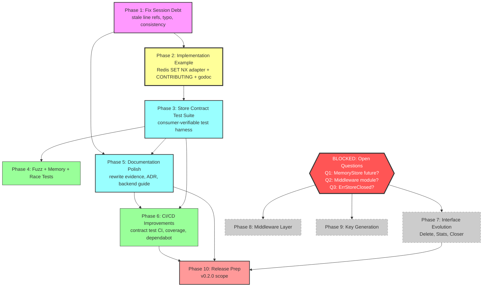

# Execution Plan: Interface-First SDK Completion

> **Created:** 2026-08-07 21:50
> **Trigger:** Post-doc-reframe status report identified debt, missing examples, and 50 candidate items
> **Goal:** Make the "interface-first SDK, you implement the backend" promise real, honest, and actionable — without Verschlimmbesserung.

---

## Context

The previous session reframed all documentation to say "go-idempotency is an interface-first SDK; it does NOT ship production backends; you implement the `Store` interface." That reframe is committed and verified (build, vet, test, lint all pass). However:

1. **Stale line-number references** in FEATURES.md, DOMAIN_LANGUAGE.md, and CHANGELOG.md no longer match `store.go` after the comment edits shifted lines.
2. **No implementation example exists** — every doc says "you implement" but nothing shows HOW. This is the single biggest credibility gap.
3. **No contract test suite exists** — the docs promise consumers can "verify their own backend implementations" but provide no tooling to do so.
4. **FEATURES.md internal inconsistency** — line 10 still says "implementation" while line 36 says "reference implementation."
5. **CONTRIBUTING.md** doesn't mention the no-backends policy.
6. **Minor typo** in AGENTS.md line 66: `*what`.`should be` _what_`.

Three open product questions (from the status report) block interface evolution and middleware work. These are NOT this plan's responsibility to answer — they are flagged as blockers in the relevant phases.

---

## Pareto Analysis

### The 1% that delivers 51%

**A concrete `Store` implementation example (Redis `SET NX` adapter).**

Right now a reader sees: "implement the Store interface against your own backend" in 9 files, then thinks: "OK, but HOW?" The docs make a claim with no evidence. A single 15-line Redis adapter example — in `doc.go` and `README.md` — instantly transforms the message from "we tell you to do it" to "here's exactly how trivial it is." Every reader who sees the example immediately internalizes: three methods, use `SET NX`, map errors to `ErrDuplicate` / `ErrInvalidTTL`, done.

This is 51% of the remaining value because it is the proof that the entire SDK positioning is real.

### The 4% that delivers 64%

**Implementation example + fix all session debt.**

The debt (stale line refs, FEATURES.md inconsistency, AGENTS.md typo) undermines the "verified against code" promise that FEATURES.md makes in its header. Fixing it restores credibility. Combined with the implementation example, the docs are now both honest AND actionable.

### The 20% that delivers 80%

**Above + Store contract test suite + CONTRIBUTING.md scope note + godoc Example() functions.**

The contract test suite is the verification tool that the docs repeatedly promise. CONTRIBUTING.md prevents wasted PRs from contributors who don't read ROADMAP.md. Godoc examples make the pattern discoverable on pkg.go.dev. Together these complete the SDK story: docs tell you to implement, the example shows you how, the contract test verifies you did it right.

### The other 20% (to reach 100%)

Everything else: fuzz tests, interface evolution (blocked on questions), middleware layer (blocked on module boundary decision), key generation utilities (needs product decision), CI/CD improvements, release preparation.

---

## Items REJECTED (Verschlimmbesserung Risk)

These items from the status report's 50-item list are **explicitly rejected** because they would make the library worse:

| #  | Item                                  | Why rejected                                                                                                                                                                                                                     |
| -- | ------------------------------------- | -------------------------------------------------------------------------------------------------------------------------------------------------------------------------------------------------------------------------------- |
| R1 | OpenTelemetry tracing support         | Adds heavy dependency (`go.opentelemetry.io/otel`). Violates the no-dependency-bloat philosophy that the entire reframe is built on. Consumers who want tracing wrap the `Store` interface themselves.                           |
| R2 | `sync.Map` evaluation                 | Premature optimization. Zero evidence of contention bottleneck. `sync.RWMutex` is the right default; benchmarks exist to revisit IF contention is measured in production. Adding complexity without data is Verschlimmbesserung. |
| R3 | Lock-free / CAS-based approaches      | Same as R2. No data supports this complexity.                                                                                                                                                                                    |
| R4 | Sharded mutex design                  | Same as R2. Evaluate only IF benchmarks show contention.                                                                                                                                                                         |
| R5 | Comparison table with other libraries | Marketing fluff. This library's positioning is clear from its docs. Comparison tables rot and invite bike-shedding.                                                                                                              |
| R6 | GoReleaser setup                      | Premature for a v0.1.x library with no release automation need. Manual `git tag` + `go list -m` works fine. Add when release frequency justifies it.                                                                             |

---

## Phase Plan (30-100 min tasks)

Sorted by importance / impact / effort / customer-value. Phases 7-9 are BLOCKED on open questions and excluded from active execution.

| Phase       | Task                                                                                                                                                                                                                                                                                                     | Impact   | Effort  | Customer Value                  | Status                      |
| ----------- | -------------------------------------------------------------------------------------------------------------------------------------------------------------------------------------------------------------------------------------------------------------------------------------------------------- | -------- | ------- | ------------------------------- | --------------------------- |
| **1**       | **Fix stale line-number references in FEATURES.md** — evidence column cites `store.go:30-48` (actual: `47-66`), `store.go:56-61` (actual: `78-83`), `store.go:118-129` (actual: `147-163`), etc.                                                                                                         | High     | 30min   | Docs credibility                | Done `e8d545c`              |
| **1**       | **Fix stale line-number reference in DOMAIN_LANGUAGE.md** — `store.go:30-48` → current                                                                                                                                                                                                                   | Medium   | 10min   | Docs credibility                | Done `e8d545c`              |
| **1**       | **Fix FEATURES.md line 10** — "implementation" → "reference implementation"                                                                                                                                                                                                                              | Medium   | 5min    | Consistency                     | Done `e8d545c`              |
| **1**       | **Fix AGENTS.md line 66 typo** — `*what`.`→` _what_`                                                                                                                                                                                                                                                     | Low      | 5min    | Polish                          | Done `e8d545c`              |
| **1**       | **Grep-verify no other stale line refs** in living docs (exclude status reports)                                                                                                                                                                                                                         | Medium   | 15min   | Docs credibility                | Done `e8d545c`              |
| **2**       | **Add Redis `SET NX` implementation example to doc.go** — show a minimal adapter implementing all 3 `Store` methods with `SET NX EX`, `DEL`, context handling, and error mapping. This is the 1%→51% item.                                                                                               | Critical | 60min   | Makes SDK promise real          | Done `43b236a`              |
| **2**       | **Add implementation example to README.md** — shorter snippet version in the Design philosophy section, linking to full example in godoc                                                                                                                                                                 | Critical | 30min   | Makes SDK promise real          | Done `43b236a`              |
| **2**       | **Add CONTRIBUTING.md scope note** — "Backend implementations (Redis, SQL, etc.) are out of scope. PRs adding backends will not be accepted. Implement the `Store` interface in your own project."                                                                                                       | High     | 15min   | Prevents wasted PRs             | Done `43b236a`              |
| **2**       | **Add godoc `Example()` function** — `func ExampleStore()` showing CheckAndRecord usage that renders on pkg.go.dev                                                                                                                                                                                       | Medium   | 30min   | Discoverability                 | Done `9db0f6e`              |
| **3**       | **Design + implement Store contract test suite** — a `contract` subpackage with `RunTests(t *testing.T, factory func() Store)` covering: basic record/seen, CheckAndRecord atomicity, TTL expiry, duplicate detection, concurrency safety, edge cases. Run against MemoryStore. Document consumer usage. | Critical | 100min  | Verifies consumer backends      | Done `46aa38d`, `9db0f6e`   |
| **4**       | **Add fuzz tests** — `FuzzCheckAndRecord`, `FuzzRecord` with arbitrary keys, TTLs                                                                                                                                                                                                                        | Medium   | 45min   | Test quality                    | Done `9db0f6e`              |
| **4**       | **Add memory benchmarks** — `testing.B` with `runtime.ReadMemStats` for large key counts                                                                                                                                                                                                                 | Low      | 30min   | Data for optimization decisions | Done `46aa38d`              |
| **4**       | **Add Close+concurrent race test** — verify no panic on use-after-close during concurrent operations                                                                                                                                                                                                     | Medium   | 30min   | Correctness                     | Done `9db0f6e`              |
| **5**       | **Rewrite FEATURES.md evidence column** — switch from brittle line numbers to symbol-name references (e.g., "`Store` interface in `store.go`")                                                                                                                                                           | Medium   | 30min   | Maintainability                 | Done `e8d545c`              |
| **5**       | **Rewrite README Features section** — lead with "Store interface" as the product, not MemoryStore features                                                                                                                                                                                               | Medium   | 30min   | Positioning                     | Done `9db0f6e`              |
| **5**       | **Add "Implementing your own backend" guide** — dedicated section in README or separate doc with patterns, pitfalls, testing approach                                                                                                                                                                    | High     | 45min   | Consumer onboarding             | Done `43b236a`              |
| **5**       | **Add ADR: Why no backends** — architecture decision record documenting the interface-first choice                                                                                                                                                                                                       | Low      | 30min   | Decision durability             | Done `9db0f6e`              |
| **6**       | **Add contract test to CI** — run `go test ./contract/...` on every push                                                                                                                                                                                                                                 | Medium   | 15min   | CI automation                   | Done `9db0f6e`              |
| **6**       | **Add code coverage reporting** — `go test -cover` + coverage badge in README                                                                                                                                                                                                                            | Low      | 30min   | Visibility                      | Done `9db0f6e`              |
| **6**       | **Add Dependabot config** — automated `go.mod` dependency scanning                                                                                                                                                                                                                                       | Low      | 15min   | Maintenance                     | Done `9db0f6e`              |
| **10**      | **Plan v0.2.0 release criteria** — document what ships in v0.2.0 (contract test suite, examples, doc fixes)                                                                                                                                                                                              | Low      | 15min   | Release clarity                 | Done `9db0f6e`              |
| **BLOCKED** | **Evaluate `Delete` method on Store interface**                                                                                                                                                                                                                                                          | High     | 60min   | Ops capability                  | BLOCKED on Q1/Q3            |
| **BLOCKED** | **Evaluate `Stats` method on Store interface**                                                                                                                                                                                                                                                           | Medium   | 60min   | Observability                   | BLOCKED on Q1               |
| **BLOCKED** | **Evaluate `StoreCloser` / `ErrStoreClosed`**                                                                                                                                                                                                                                                            | Medium   | 45min   | Lifecycle management            | BLOCKED on Q3               |
| **BLOCKED** | **Middleware package design + implementation**                                                                                                                                                                                                                                                           | Critical | 200min+ | Ecosystem integration           | BLOCKED on Q2               |
| **BLOCKED** | **Key generation utilities**                                                                                                                                                                                                                                                                             | Medium   | 100min+ | Consumer convenience            | BLOCKED on product decision |

---

## Sub-Task Breakdown (max 12 min each)

Every task above decomposed into atomic, verifiable steps.

### Phase 1: Immediate Debt Repair

| #    | Sub-task                                                                                   | Est   | Verifies                             |
| ---- | ------------------------------------------------------------------------------------------ | ----- | ------------------------------------ |
| 1.1  | Read current `store.go` line numbers via `lsp_symbols` for all symbols                     | 2min  | Symbol → line mapping captured       |
| 1.2  | Update FEATURES.md `Store interface` evidence: `store.go:30-48` → current lines            | 3min  | Line numbers match                   |
| 1.3  | Update FEATURES.md `MemoryStore` evidence: `store.go:56-61` → current                      | 2min  | Line numbers match                   |
| 1.4  | Update FEATURES.md `Atomic CheckAndRecord` evidence: `store.go:118-129` → current          | 3min  | Line numbers match                   |
| 1.5  | Update FEATURES.md `TTL-based expiration` evidence: all 3 refs → current                   | 3min  | Line numbers match                   |
| 1.6  | Update FEATURES.md `Configurable sweep interval` evidence: `store.go:63-79` → current      | 2min  | Line numbers match                   |
| 1.7  | Update FEATURES.md `Idempotent Record` evidence: `store.go:103-114` → current              | 2min  | Line numbers match                   |
| 1.8  | Update FEATURES.md `ErrDuplicate` evidence: `store.go:15-18` → current                     | 2min  | Line numbers match                   |
| 1.9  | Update FEATURES.md `Graceful shutdown` evidence: `store.go:132-134` → current              | 2min  | Line numbers match                   |
| 1.10 | Update DOMAIN_LANGUAGE.md `Store` evidence: `store.go:30-48` → current                     | 3min  | Line numbers match                   |
| 1.11 | Fix FEATURES.md line 10: "implementation" → "reference implementation"                     | 2min  | grep "implementation" in FEATURES.md |
| 1.12 | Fix AGENTS.md line 66: `*what`.`→` _what_`                                                 | 2min  | grep confirms fix                    |
| 1.13 | Grep all `.md` files for `store.go:\d+` references; verify each against actual             | 10min | All living docs accurate             |
| 1.14 | Decide on CHANGELOG.md historical refs (leave as historical record, don't rewrite history) | 2min  | Documented decision                  |
| 1.15 | Run `go build`, `go vet`, `golangci-lint` to confirm no breakage                           | 3min  | All pass                             |

### Phase 2: Make the SDK Promise Actionable

| #    | Sub-task                                                                             | Est   | Verifies              |
| ---- | ------------------------------------------------------------------------------------ | ----- | --------------------- |
| 2.1  | Design the Redis adapter example: struct fields (client, key prefix), constructor    | 10min | Design documented     |
| 2.2  | Write `Seen` method for Redis adapter: `GET` + TTL handling (or `EXISTS`)            | 8min  | Method correct        |
| 2.3  | Write `Record` method for Redis adapter: `SET NX` (no-op on existing)                | 8min  | Method correct        |
| 2.4  | Write `CheckAndRecord` method for Redis adapter: `SET NX EX` → map to ErrDuplicate   | 10min | Atomicity correct     |
| 2.5  | Write error mapping: Redis nil → not-found, Redis reply → ErrDuplicate/ErrInvalidTTL | 8min  | Error semantics match |
| 2.6  | Add the complete example to `doc.go` as a godoc code block                           | 8min  | Renders in godoc      |
| 2.7  | Add a shorter snippet version to README.md Design philosophy section                 | 8min  | Renders in README     |
| 2.8  | Verify example is syntactically correct Go (parse mentally or with `gofmt`)          | 5min  | No syntax errors      |
| 2.9  | Add CONTRIBUTING.md scope note under "How to Contribute"                             | 5min  | Note present          |
| 2.10 | Write `func ExampleStore()` in `example_test.go` showing CheckAndRecord usage        | 10min | Renders on pkg.go.dev |
| 2.11 | Write `func ExampleMemoryStore()` showing basic lifecycle                            | 8min  | Renders on pkg.go.dev |
| 2.12 | Run `go test ./...` to verify example test compiles and runs                         | 3min  | Tests pass            |

### Phase 3: Store Contract Test Suite

| #    | Sub-task                                                                                                   | Est   | Verifies                        |
| ---- | ---------------------------------------------------------------------------------------------------------- | ----- | ------------------------------- |
| 3.1  | Decide on contract test structure: `contract` subpackage vs. exported test helper                          | 10min | Design decision documented      |
| 3.2  | Create `contract/` directory + `contract.go` with `RunTests(t *testing.T, factory StoreFactory)` signature | 8min  | Package compiles                |
| 3.3  | Define `StoreFactory` type: `type StoreFactory func(t *testing.T) idempotency.Store`                       | 3min  | Type defined                    |
| 3.4  | Write contract test: `Seen` returns false for unseen key                                                   | 5min  | Test passes against MemoryStore |
| 3.5  | Write contract test: `Record` then `Seen` returns true                                                     | 5min  | Test passes                     |
| 3.6  | Write contract test: `CheckAndRecord` returns nil on first call, ErrDuplicate on second                    | 5min  | Test passes                     |
| 3.7  | Write contract test: `Record` rejects non-positive TTL with ErrInvalidTTL                                  | 5min  | Test passes                     |
| 3.8  | Write contract test: `CheckAndRecord` rejects non-positive TTL with ErrInvalidTTL                          | 5min  | Test passes                     |
| 3.9  | Write contract test: expired key is re-recordable after TTL passes                                         | 8min  | Test passes                     |
| 3.10 | Write contract test: `Record` on existing key is no-op (TTL not extended)                                  | 8min  | Test passes                     |
| 3.11 | Write contract test: 200 concurrent `CheckAndRecord` with same key → exactly one winner                    | 10min | Test passes with -race          |
| 3.12 | Write contract test: empty key handling                                                                    | 5min  | Test passes                     |
| 3.13 | Write `contract_test.go` in root package that runs contract tests against MemoryStore                      | 8min  | All tests pass                  |
| 3.14 | Document consumer usage: "create a `_test.go` file, import the contract package, call RunTests"            | 8min  | Documentation present           |
| 3.15 | Run `go test ./... -race` to verify all contract tests pass                                                | 5min  | All pass                        |

### Phase 4: Testing Quality

| #   | Sub-task                                                                                | Est   | Verifies            |
| --- | --------------------------------------------------------------------------------------- | ----- | ------------------- |
| 4.1 | Write `FuzzCheckAndRecord` — arbitrary key, TTL, concurrent calls                       | 10min | Fuzz runs           |
| 4.2 | Write `FuzzRecord` — arbitrary key, TTL                                                 | 8min  | Fuzz runs           |
| 4.3 | Run fuzz tests for 30 seconds to verify no crashes                                      | 2min  | No panic            |
| 4.4 | Write Close+concurrent test: start 50 goroutines doing CheckAndRecord, Close mid-flight | 10min | No panic with -race |
| 4.5 | Write memory benchmark: Record 10K keys, measure allocs via ReadMemStats                | 10min | Benchmark runs      |
| 4.6 | Write memory benchmark: Record 10K keys + sweep, measure reclaim                        | 10min | Benchmark runs      |
| 4.7 | Run full test suite with `-race` to verify                                              | 3min  | All pass            |

### Phase 5: Documentation Polish

| #   | Sub-task                                                                                      | Est   | Verifies                    |
| --- | --------------------------------------------------------------------------------------------- | ----- | --------------------------- |
| 5.1 | Rewrite FEATURES.md evidence column: replace all `store.go:NN-MM` with symbol-name references | 10min | No line numbers in evidence |
| 5.2 | Rewrite README Features section: lead with "Store interface" as the product                   | 10min | Interface is the headline   |
| 5.3 | Add "Implementing your own backend" section to README with patterns + pitfalls                | 10min | Section present             |
| 5.4 | Write ADR: "Why no backends" — document the decision, alternatives, tradeoffs                 | 10min | ADR present                 |
| 5.5 | Update ROADMAP.md to reference the contract test package (no longer "planned")                | 5min  | ROADMAP accurate            |
| 5.6 | Update TODO_LIST.md: mark contract test suite as done, update remaining items                 | 5min  | TODO accurate               |
| 5.7 | Update CHANGELOG.md with all new changes                                                      | 8min  | Changelog current           |
| 5.8 | Cross-check all docs for consistency (grep for "planned backend", "future Redis", etc.)       | 10min | No contradictions           |

### Phase 6: CI/CD and Infrastructure

| #   | Sub-task                                                | Est  | Verifies               |
| --- | ------------------------------------------------------- | ---- | ---------------------- |
| 6.1 | Add `go test ./contract/...` to CI workflow             | 5min | CI runs contract tests |
| 6.2 | Add `go test -cover` step to CI, output coverage        | 5min | Coverage reported      |
| 6.3 | Add coverage badge to README (once CI reports coverage) | 5min | Badge renders          |
| 6.4 | Create `.github/dependabot.yml` for go.mod scanning     | 5min | Dependabot active      |

### Phase 10: Release Preparation

| #    | Sub-task                                                                                   | Est   | Verifies         |
| ---- | ------------------------------------------------------------------------------------------ | ----- | ---------------- |
| 10.1 | Document v0.2.0 scope: contract test suite, implementation examples, doc fixes, fuzz tests | 10min | Scope documented |
| 10.2 | Update ROADMAP.md versioning section with v0.2.0 target                                    | 5min  | ROADMAP accurate |

---

## Mermaid Execution Graph

**Legend:**

- Pink = Phase 1 (debt repair)
- Yellow with thick border = Phase 2 (the 1%→51% item)
- Blue = Phases 3, 5 (high-value engineering + docs)
- Green = Phases 4, 6 (quality + infrastructure)
- Red = Phase 10 (release gate)
- Red diamond = BLOCKED on open questions
- Gray dashed = Blocked phases

---

## Open Questions (blocking Phases 7-9)

These three questions from the status report MUST be answered by the project owner before interface evolution, middleware, or key generation work can proceed:

1. **Should `MemoryStore` be deprecated/removed eventually, or kept permanently?** Affects whether the SDK pushes consumers toward their own implementations or provides a permanent escape hatch.

2. **Should the middleware package live in this module or a separate module?** Determines whether transport dependencies (HTTP, gRPC) enter the core module or stay isolated.

3. **Should there be an `ErrStoreClosed` sentinel error?** Affects the `Store` interface contract for backend lifecycle management.

---

## Anti-Verschlimmbesserung Checklist

Before completing ANY task, verify:

- [ ] Does this add a dependency to `go.mod`? If yes, STOP and justify.
- [ ] Does this change the `Store` interface? If yes, STOP — interface changes are blocked on open questions.
- [ ] Does this add complexity without clear consumer value? If yes, REJECT.
- [ ] Does this optimize without data? If yes, REJECT.
- [ ] Is this within the library's scope (storage contract only)? If no, REJECT.
- [ ] Does this make the docs LESS honest? If yes, REJECT.
- [ ] Am I changing something I don't fully understand? If yes, STOP and research.

---

## Resolution (2026-08-29)

All active phases (1-6, 10) were executed and verified in the 2026-08-07 sessions — see `docs/status/2026-08-07_22-15_execution-plan-completion.md`; per-row verdicts with commit hashes are inline in the Phase Plan table above. The only deferred piece is the Phase 6 coverage badge: CI reports coverage and uploads the artifact (`9db0f6e`), but the badge waits for a coverage-service choice and is tracked in TODO_LIST.md. The BLOCKED phases remain blocked on the open product questions and are tracked in TODO_LIST.md (interface evolution, middleware) and ROADMAP.md (key generation utilities). Question 1 of the parent status report (keep MemoryStore or deprecate it) was answered by the owner — "deprecate it" — and executed in `5848f38` and `67fa850`. Archived after full execution per docs-health.
