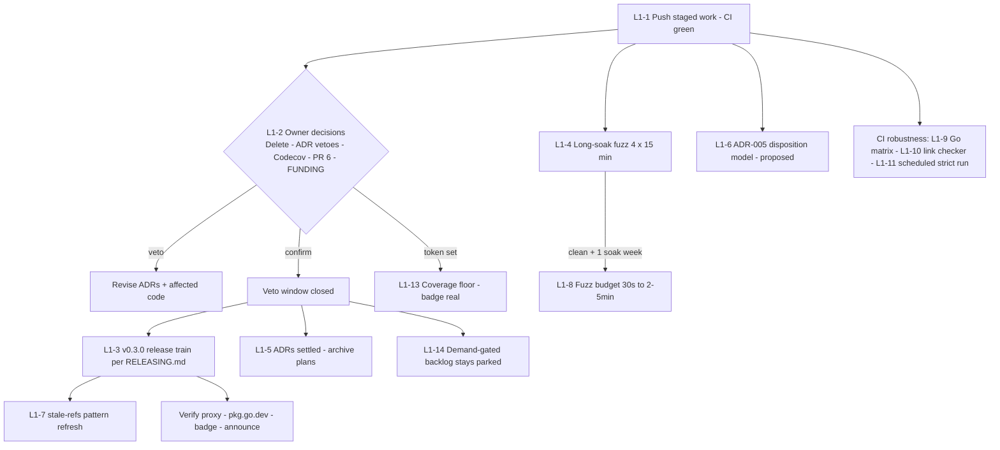

# Plan: v0.3.0 Release & Hardening — Pareto Execution (1% → 100%)

**Created:** 2026-08-29 19:38 CEST
**Scope:** ALL open TODOs from `TODO_LIST.md`, `ROADMAP.md`, and the 2026-08-29 status report (section f/g), prioritized by impact / effort / customer value.
**Method:** Pareto decomposition — find the smallest set of actions that delivers the majority of the result, then the long tail to 100%.
**Ground rule:** NO VERSCHLIMMBESSERN. Every step is either additive (docs, tests, CI jobs) or gated behind an explicit owner decision. Every step names its verification. No step touches the `Store` interface (ADR-004), adds backend dependencies (ADR-001), or breaks middleware stdlib-only (ADR-002).

> **Status:** ✅ PARTIALLY EXECUTED 2026-08-29 (same evening) — every non-gated branch is done; the remainder is owner-gated by design.
>
> **Executed:**
>
> - **L1-1** (earlier the same day): 7 commits pushed (`52afbf3..abfe140`), CI 8/8 green (run 33266273402).
> - **L1-4 long-soak fuzz** (commits `a582ee6` context): 15 min × 4 targets, Go 1.26.7 linux/amd64, 32 workers — FuzzCheckAndRecord ≈260M execs, FuzzRecord 242.7M, FuzzConcurrentMixed ≈205M, FuzzDispatch 164.2M. Zero crashers, zero findings, no `testdata/` additions (12.9–12.14 done; triage had nothing to triage). This soak starts L1-8's clean-soak-week clock.
> - **L1-12 `contract.RunTestsContextAware`** (commit `a582ee6`): separate entry point (design notes in `contract/contract_context.go`) instead of an `Options` flag — the main suite stays meaningful for context-blind stores, opt-in names the extra promise, surface stays frozen. 5 subtests pin the two cancellation invariants; 5 new broken-Store scenarios (context-blind and claim-poisoning variants) prove detection — 19 negative scenarios total now share one subprocess harness. Self-tested against a `ContextAware` wrapper in `internal/teststore`; README/CONTRIBUTING/FEATURES/AGENTS/CHANGELOG synced in the same commit (12.47–12.51).
> - **L1-9 Go compatibility matrix** (commit `ce4a969`): test job runs the go.mod toolchain plus the previous Go release (`oldstable`); coverage/Codecov stay on the pinned entry. Both matrix entries green in run 33267632461 (12.39–12.40; the "PR branch" verification was satisfied by the master-run watch per this repo's CI-edit precedent).
> - **L1-10 lychee link check** (commits `ce4a969`, `5ada011`): SHA-pinned action v2.9.0, authenticated, 3 retries; fragment anchors intentionally unchecked (12.42 resolved by default-off, documented in the workflow). First run caught 2 real dead links and both were fixed: the README middleware pkg.go.dev page (only exists after v0.3.0 — now an in-repo link until the release) and a private-repo link in a `docs/feedback` snapshot (now excluded from the scan, same historical-snapshot policy as the stale-refs guard) (12.41–12.44).
> - **L1-11 scheduled strict-timing run** (commit `ce4a969`): weekly full-CI `schedule:` trigger plus a scheduled-only contract pass at `TimingScale: 3` through the new `GO_IDEMPOTENCY_CONTRACT_TIMING_SCALE` knob on the scaled self-test; a bogus value fails loudly; local dry run at scale 3 green (12.45–12.46).
>
> **Verification:** CI run 33267632461 green on `5ada011` — 9 job conclusions, including both Go matrix entries and the link check. Local gates re-run bare-exit before every commit.
>
> **Owner-gated (untouched, as planned):** L1-2 decision batch, L1-3 release train, L1-5 ADR settle + archive, L1-6 ADR-005 draft, L1-7 post-release stale-refs refresh, L1-8 fuzz-budget raise (soak week clock started 2026-08-29), L1-13 coverage floor (needs `CODECOV_TOKEN`), L1-14 demand-gated backlog stays parked.
>
> **Closed 2026-09-05:** the owner's explicit go-ahead closed the veto window and the owner-gated branches executed in one session. **L1-2** — no vetoes: ADR-002/004 confirmed and their statuses settled, `Delete` stays deferred behind its demonstrated-need trigger, FUNDING stays omitted, Dependabot PR #6 merged 2026-09-04, `CODECOV_TOKEN` remains unset (L1-13 stays blocked on it). **L1-3** — v0.3.0 release train run per RELEASING.md (changelog finalized, annotated tag pushed, GitHub Release created, module proxy + pkg.go.dev verified). **L1-5** — ADR statuses settled and both 2026-08-29 plans archived (this file included). **L1-7** — post-release stale-refs pattern refresh. **L1-8** — fuzz budget raised to 3 min per target after the clean soak week (2026-08-29 → 2026-09-05), re-verified locally with zero findings before raising. Still parked by design: L1-6 (ADR-005 draft awaits its own demand trigger) and L1-14.

---

## 1. Pareto Analysis

| Slice              | Cumulative result | Actions                                                                                                                                                                                                                                                                                                                                                                                                                                                                                                                                    |
| ------------------ | ----------------- | ------------------------------------------------------------------------------------------------------------------------------------------------------------------------------------------------------------------------------------------------------------------------------------------------------------------------------------------------------------------------------------------------------------------------------------------------------------------------------------------------------------------------------------------ |
| **1%**             | **~51%**          | (a) Push the 6 staged commits (detection proofs, error-contract locks, middleware fuzz, docs syncs) and watch CI go green — converts finished local work into _visible_ credibility. (b) The owner answers the 5 decision points (Delete, ADR-002/003/004 veto, Codecov token, PR #6, FUNDING) — minutes of owner time that unblock the entire release train.                                                                                                                                                                              |
| **4%**             | **~64%**          | + Execute the **v0.3.0 release train** per RELEASING.md (changelog finalize → tag → GitHub Release → module-proxy + pkg.go.dev verification). This ships the whole hardening session to consumers: middleware, RunTestsStrict, proven-detection negative tests, runnable example, migration guide, replay recipe, governance files. + Settle ADR statuses and archive executed plans once the veto window closes.                                                                                                                          |
| **20%**            | **~80%**          | + **Long-soak fuzz** (4 targets × 15 min) before tagging, and the **post-release stale-refs pattern refresh** so the docs guard learns the new release-status vocabulary. + Fuzz-budget raise (30 s → 2–5 min) once a clean soak week exists.                                                                                                                                                                                                                                                                                              |
| **Remaining work** | **100%**          | + CI robustness: Go compatibility matrix, link checker, scheduled strict-timing run. + `contract.RunTestsContextAware` (optional cancellation-semantics suite). + Coverage floor once Codecov is active. + ADR-005 draft (claim-disposition model: Reject/Skip/Replay) as a pre-declared, demand-gated shape. + Demand-gated backlog (Event=Skip middleware, Delete when triggered, gRPC module, key-gen utilities, metrics hooks, lock-strategy evaluation, clock injection) — parked with documented triggers, deliberately unscheduled. |

**Reading:** the 1% is _decisions + push_, not code. Everything expensive is either mechanical (release train) or demand-gated; nothing high-impact is left un-gated and unbuilt — the session's buildable backlog was completed on 2026-08-29 (detection proofs, error locks, middleware fuzz, docs syncs).

---

## 2. Level-1 Plan — tasks of 30–100 minutes each (ALL TODOs, sorted by impact/value/effort)

| #     | Task                                                                                                                                                                                                                                     | Min | Impact   | Consumer value | Gate / trigger                                |
| ----- | ---------------------------------------------------------------------------------------------------------------------------------------------------------------------------------------------------------------------------------------- | --- | -------- | -------------- | --------------------------------------------- |
| L1-1  | Push staged work; CI green end-to-end                                                                                                                                                                                                    | 30  | Critical | High           | none — executing now                          |
| L1-2  | **Owner decision batch**: Delete per ADR-004 · veto/confirm ADR-002/003/004 · `CODECOV_TOKEN` · Dependabot PR #6 (CI green) · FUNDING yes/no                                                                                             | 45  | Critical | Medium         | **OWNER ONLY**                                |
| L1-3  | **v0.3.0 release train** per RELEASING.md (content already staged in CHANGELOG `[Unreleased]`)                                                                                                                                           | 100 | Critical | High           | L1-2 — veto window closed                     |
| L1-4  | **Long-soak fuzz**: FuzzCheckAndRecord, FuzzRecord, FuzzConcurrentMixed, FuzzDispatch — 15 min each, wall-clock mostly unattended, triage after                                                                                          | 75  | High     | Medium         | run before L1-3                               |
| L1-5  | Settle ADR-002/003/004 statuses; archive executed plans to `docs/planning/archived/`                                                                                                                                                     | 30  | Medium   | Low            | L1-2                                          |
| L1-6  | **ADR-005 draft**: claim-disposition model (Reject/Skip/Replay) — pre-declared shape, status _proposed_, demand-gated                                                                                                                    | 45  | Medium   | Medium         | owner nod to publish the draft                |
| L1-7  | Post-release stale-refs pattern refresh (teach the guard the new release-status phrases)                                                                                                                                                 | 30  | Medium   | Low            | after L1-3                                    |
| L1-8  | Raise CI fuzz budget 30 s → 2–5 min per target                                                                                                                                                                                           | 30  | Medium   | Low            | L1-4 clean + one soak week                    |
| L1-9  | Go compatibility matrix job (go.mod version + previous release)                                                                                                                                                                          | 30  | Medium   | Medium         | none                                          |
| L1-10 | Link checker (lychee or equivalent) in the docs job                                                                                                                                                                                      | 45  | Medium   | Medium         | none                                          |
| L1-11 | Scheduled weekly job: `RunTestsStrict{TimingScale: 3}`                                                                                                                                                                                   | 30  | Low      | Low            | none                                          |
| L1-12 | `contract.RunTestsContextAware` — optional suite asserting cancellation semantics for context-honoring backends                                                                                                                          | 100 | Medium   | Medium         | design paragraph first                        |
| L1-13 | Coverage floor (fail under ~90%) + verify badge shows a real number                                                                                                                                                                      | 30  | Medium   | Low            | Codecov token (L1-2)                          |
| L1-14 | Demand-gated backlog: Event middleware (Skip disposition) · Delete if ADR-004 trigger fires · gRPC adapter as own module (ADR-002 split trigger) · key-generation utilities · metrics hooks · lock-strategy evaluation · clock injection | —   | —        | —              | documented triggers only; **never scheduled** |

---

## 3. Level-2 Plan — subtasks of ≤12 minutes each (ALL TODOs, sorted by importance)

| #     | Subtask                                                                                                                          | Min | Belongs to |
| ----- | -------------------------------------------------------------------------------------------------------------------------------- | --- | ---------- |
| 12.1  | `git push origin master` (6 staged commits + this plan)                                                                          | 2   | L1-1       |
| 12.2  | `gh run watch` / poll the triggered CI run                                                                                       | 10  | L1-1       |
| 12.3  | Triage any red job (none expected: local gates all green)                                                                        | 12  | L1-1       |
| 12.4  | Owner: decide `Delete` — keep deferred or schedule for v0.3.0/v0.4.0 with ops-recovery framing                                   | 10  | L1-2       |
| 12.5  | Owner: confirm or veto ADR-002 + ADR-003                                                                                         | 5   | L1-2       |
| 12.6  | Owner: `gh secret set CODECOV_TOKEN <token>`                                                                                     | 3   | L1-2       |
| 12.7  | Owner: merge or close Dependabot PR #6 (checkout 4.4.0→7.0.1, CI green)                                                          | 5   | L1-2       |
| 12.8  | Owner: FUNDING.yml — yes/no + mechanism, or confirm omission                                                                     | 5   | L1-2       |
| 12.9  | Soak: `go test -fuzz=FuzzCheckAndRecord -fuzztime=15m`                                                                           | 12  | L1-4       |
| 12.10 | Soak: `FuzzRecord -fuzztime=15m`                                                                                                 | 12  | L1-4       |
| 12.11 | Soak: `FuzzConcurrentMixed -fuzztime=15m`                                                                                        | 12  | L1-4       |
| 12.12 | Soak: `middleware FuzzDispatch -fuzztime=15m`                                                                                    | 12  | L1-4       |
| 12.13 | Triage any crasher: minimize into `testdata/`, fix, re-run                                                                       | 12  | L1-4       |
| 12.14 | Record soak results (execs/sec, findings) in this plan's completion note                                                         | 5   | L1-4       |
| 12.15 | Full local gates: gofmt · vet · golangci-lint · `-race` suite · stale-refs · example run · tidy-diff                             | 12  | L1-3       |
| 12.16 | Finalize CHANGELOG `[Unreleased]` → `v0.3.0` + date + compare link, swept against `git log v0.2.0..HEAD`                         | 12  | L1-3       |
| 12.17 | Draft `docs/releases/v0.3.0-notes.md` from the changelog section                                                                 | 12  | L1-3       |
| 12.18 | Commit `release: v0.3.0` (gates re-run bare-exit first)                                                                          | 5   | L1-3       |
| 12.19 | `git tag -a v0.3.0 -m …` + push the tag                                                                                          | 3   | L1-3       |
| 12.20 | Verify module proxy serves v0.3.0 (`GOPROXY` fetch / `go list -m …@v0.3.0` in a tmpdir)                                          | 10  | L1-3       |
| 12.21 | `gh release create v0.3.0` with the notes (mark Latest)                                                                          | 10  | L1-3       |
| 12.22 | Verify pkg.go.dev: renders `middleware` + `example`, hides `internal`, `Deprecated:` notices intact                              | 10  | L1-3       |
| 12.23 | Verify Codecov badge flips to a real % (token set) or honestly stays "unknown" (no token)                                        | 5   | L1-3       |
| 12.24 | Draft short announcement (GitHub Discussion / social) naming the contract suite + deprecation                                    | 12  | L1-3       |
| 12.25 | Flip ADR-002/003 statuses from "provisionally accepted" to settled Accepted                                                      | 5   | L1-5       |
| 12.26 | Set ADR-004 status per the Delete answer                                                                                         | 5   | L1-5       |
| 12.27 | `mkdir docs/planning/archived` + `git mv` the executed plan/status docs                                                          | 5   | L1-5       |
| 12.28 | `grep -rn` for links to the moved docs; fix every reference                                                                      | 10  | L1-5       |
| 12.29 | Prune TODO_LIST of resolved gate items                                                                                           | 5   | L1-5       |
| 12.30 | ADR-005: write Context — taxonomy-vs-axis insight; the three dispositions                                                        | 12  | L1-6       |
| 12.31 | ADR-005: Decision + demand triggers (event consumer → Skip; Stripe-style API → Replay)                                           | 10  | L1-6       |
| 12.32 | ADR-005: Alternatives + Consequences (Store untouched; Replay = recipe productized; Skip ≈ 20 lines; Await rejected per ADR-004) | 12  | L1-6       |
| 12.33 | Add ADR-005 row to `docs/adr/README.md` index                                                                                    | 3   | L1-6       |
| 12.34 | Inventory post-release stale phrases (e.g. "unreleased", "staging")                                                              | 10  | L1-7       |
| 12.35 | Add patterns to `scripts/check-stale-refs.sh`                                                                                    | 5   | L1-7       |
| 12.36 | Run the guard across the repo; fix every hit                                                                                     | 10  | L1-7       |
| 12.37 | Bump `fuzztime` in ci.yml (30 s → 2–5 min)                                                                                       | 5   | L1-8       |
| 12.38 | Sanity-check the fuzz job's wall-clock budget on CI                                                                              | 10  | L1-8       |
| 12.39 | Add `strategy.matrix` (go.mod version + N-1) to the test job                                                                     | 10  | L1-9       |
| 12.40 | Verify matrix expand/collapse behavior on a PR branch                                                                            | 10  | L1-9       |
| 12.41 | Pick lychee action, pin by commit SHA                                                                                            | 10  | L1-10      |
| 12.42 | Configure excludes for false-positive anchors (pkg.go.dev `#hdr-…` links)                                                        | 10  | L1-10      |
| 12.43 | Add the link-check step to the docs job                                                                                          | 5   | L1-10      |
| 12.44 | Fix every flagged link (docs rot includes link rot)                                                                              | 12  | L1-10      |
| 12.45 | Add `schedule:` trigger + `TimingScale: 3` step to ci.yml                                                                        | 5   | L1-11      |
| 12.46 | Local dry run: `RunTestsStrict{TimingScale: 3}` passes once                                                                      | 10  | L1-11      |
| 12.47 | Write the design paragraph (Options field vs separate entry point) in `contract.go` docs                                         | 12  | L1-12      |
| 12.48 | Implement the optional cancellation suite                                                                                        | 12  | L1-12      |
| 12.49 | Context-aware teststore wrapper + self-test wiring                                                                               | 12  | L1-12      |
| 12.50 | Negative scenario: a context-blind store that consumes the claim on cancellation                                                 | 12  | L1-12      |
| 12.51 | Sync README backend section + CONTRIBUTING test list                                                                             | 10  | L1-12      |
| 12.52 | Decide the threshold (~90%) and the enforcement mechanism (codecov.yml / CI step)                                                | 10  | L1-13      |
| 12.53 | Add the floor; document it in CONTRIBUTING                                                                                       | 5   | L1-13      |
| 12.54 | Verify the badge shows a real % and the floor is loud                                                                            | 5   | L1-13      |

(L1-14 has no subtasks by design: each item is parked behind a documented trigger in `TODO_LIST.md` / `ROADMAP.md` — building them early is how this repo would get Verschlimmbessert.)

---

## 4. Execution Graph

**Critical path:** L1-1 → L1-2 → L1-3 → (L1-7, H). Everything else is parallelizable or deliberately parked.

---

## 5. Guard Rails (anti-Verschlimmbesserung)

1. **Interface freeze:** no `Store` method changes without ADR-004's trigger (Delete, ErrStoreClosed, Stats — all deferred).
2. **No backends, no drivers:** ADR-001 holds — `internal/teststore` stays module-internal and test-only.
3. **Middleware stays stdlib-only** (ADR-002); any transport needing dependencies becomes its own module first.
4. **No BoundedStore** (ADR-003): durability position is documented, not half-implemented.
5. **Invariant ↔ negative test pairing:** every new contract invariant lands with its broken-Store scenario + README table row in the same PR.
6. **Gates before every commit, bare exit codes** (no pipes masking failures — the documented 3-dirty-commits incident).
7. **Foreign changes are not ours to merge:** Dependabot PR #6 waits for the owner even though its CI is green.
8. **Releases wait for the veto window:** v0.3.0 content is frozen and staged; the tag is a 20-minute mechanical act once L1-2 lands.

## 6. Verification Model

- Every code-adjacent task: full local gate suite (`gofmt`, `go vet`, `golangci-lint` after `config verify`, `go test ./... -race -count=1`, `scripts/check-stale-refs.sh`, `go run ./example`, tidy-diff in a tmpdir copy).
- Release tasks: proxy fetch + pkg.go.dev fetch + GitHub Release render — proof, not assumption.
- CI tasks: job green on a PR branch before landing on master.
- This plan gets a completion annotation per task (same pattern as the executed v0.2.0 plan doc).

---

_Point-in-time planning snapshot. Living status lives in TODO_LIST.md / ROADMAP.md._
